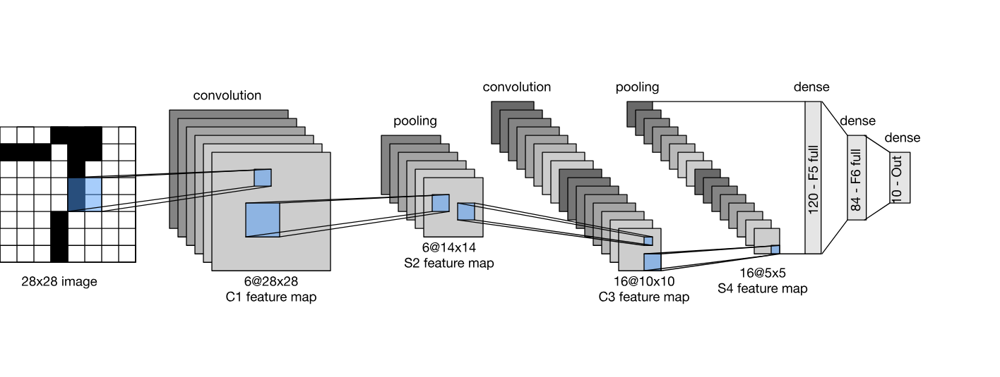
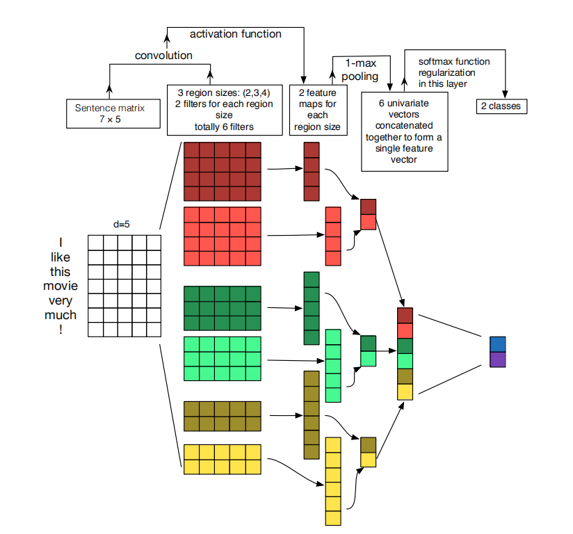

# LeNet-App-Streamlit
This project includes interactive applications powered by LeNet and TextCNN architectures. It demonstrates the use of Convolutional Neural Networks (CNNs) for image classification and sentiment analysis through user-friendly Streamlit application.

**LeNet Architecture**:

**TextCNN Architecture**:
